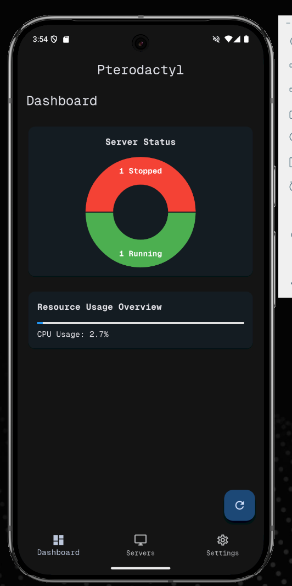
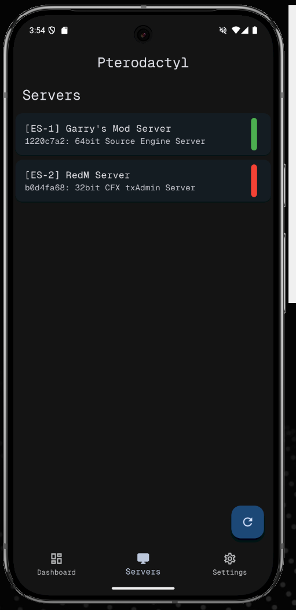
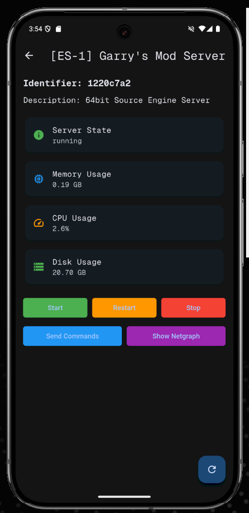

# Pterodactyl Mobile

A Flutter-based mobile application for managing Pterodactyl servers.

## Features
- View server details and status.
- Start, stop, and restart servers.
- Monitor server resource usage.
- Send commands to servers.

## Screenshots

## License
This project is for educational purposes only.

## Development

### Key Classes and Methods

#### `PteroMainApp` ([lib/main.dart](lib/main.dart))
- **Description**: The main entry point of the application.
- **Custom Methods**:
  - `themeListener`: Updates the app's theme when the theme manager notifies changes.

#### `ServerDetail` ([lib/pages/server_detail.dart](lib/pages/server_detail.dart))
- **Description**: Displays detailed information about a specific server.
- **Custom Methods**:
  - `_sendServerCommand(String command)`: Sends a command (e.g., start, stop, restart) to the server.
  - `_fetchServerDetails()`: Fetches server details like state, memory, CPU, and disk usage.
  - `_updateServerState(String state)`: Updates the server state display.

#### `ServerNetgraph` ([lib/pages/server_netgraph.dart](lib/pages/server_netgraph.dart))
- **Description**: Displays a network graph for monitoring server traffic.
- **Custom Methods**:
  - `_fetchNetworkData()`: Fetches network traffic data for the graph.
  - `_buildGraph()`: Constructs the network graph using the fetched data.

#### `Servers` ([lib/pages/servers.dart](lib/pages/servers.dart))
- **Description**: Displays a list of servers.
- **Custom Methods**:
  - `_refreshPage()`: Refreshes the server list.
  - `_fetchServers()`: Fetches the list of servers from the API.

#### `Settings` ([lib/pages/settings.dart](lib/pages/settings.dart))
- **Description**: Allows users to configure API settings and toggle dark mode.
- **Custom Methods**:
  - `buildExpandableSettingsItem`: Creates expandable settings for API key and base URL.
  - `setBoolToSharedPreferences(String key, bool value)`: Saves a boolean preference.
  - `getBoolFromSharedPreferences(String key)`: Retrieves a boolean preference.

#### `ResourceCard` ([lib/widgets/resource_card.dart](lib/widgets/resource_card.dart))
- **Description**: A reusable widget for displaying resource usage (e.g., memory, CPU, disk).
- **Key Features**:
  - Displays an icon, title, and formatted resource usage.

#### `ThemeManager` ([lib/theme/theme_manager.dart](lib/theme/theme_manager.dart))
- **Description**: Manages the app's theme (light or dark).
- **Custom Methods**:
  - `toggleTheme(bool isDark)`: Toggles between light and dark themes.

#### `API Utilities` ([lib/util/api.dart](lib/util/api.dart))
- **Description**: Contains helper methods for API interactions.
- **Custom Methods**:
  - `fetchData(String endpoint)`: Fetches data from the specified API endpoint.
  - `sendCommand(String endpoint, String command)`: Sends a command to the server.

#### `NotificationUtil` ([lib/util/notification_util.dart](lib/util/notification_util.dart))
- **Description**: Handles notifications for server events.
- **Custom Methods**:
  - `showNotification(String title, String message)`: Displays a notification.

#### `ServerStateUtil` ([lib/util/server_state_util.dart](lib/util/server_state_util.dart))
- **Description**: Provides utilities for interpreting server states.
- **Custom Methods**:
  - `getStateColor(String state)`: Returns a color based on the server state.